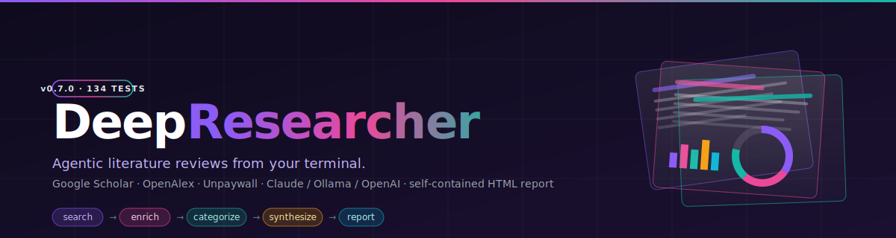

<p align="center">
  
</p>

<p align="center">
  <a href="https://www.python.org/downloads/"></a>
  <a href="LICENSE"></a>
  
  
</p>

<p align="center">
  <a href="#quick-start">Quick Start</a> &middot;
  <a href="#mcp-server">MCP Server</a> &middot;
  <a href="#how-it-works">How It Works</a> &middot;
  <a href="#html-report">HTML Report</a> &middot;
  <a href="#sample-output">Sample Output</a> &middot;
  <a href="#configuration">Configuration</a>
</p>

---

> **Fork notice.** This is a fork of [jackswl/deep-researcher](https://github.com/jackswl/deep-researcher) that adds an interactive TUI, `--provider claude` / `--provider chatgpt` (subscription OAuth, no API key), a styled **HTML report**, an **MCP server** (Claude Desktop / Claude Code can run research mid-conversation), **dual-provider comparison** (`--compare`), Scopus search, and Windows/PowerShell encoding fixes. The Google Scholar pipeline, OpenAlex enrichment, and synthesis architecture are upstream's work — go star the [original repo](https://github.com/jackswl/deep-researcher).

---

Deep Researcher searches **Google Scholar** for academically-ranked papers, enriches them with full metadata from **OpenAlex**, and uses an LLM to write a **structured literature review** with consistent citations — then drops a beautiful, self-contained HTML report into your browser.

### Highlights

|   |   |
|---|---|
| **100 papers** | Google Scholar semantic search — no keyword hacks, no irrelevant results |
| **Structured synthesis** | Papers categorized by theme, with per-category analysis and cross-category patterns |
| **Consistent `[N]` citations** | Every reference in the text matches the reference list — no hallucinated sources |
| **Styled HTML report** | Auto-opens in your browser with clickable citations, DOI/Open Access links, dark mode, and a sticky TOC |
| **Executive summary + charts** | HTML report opens with a 100-150 word TL;DR plus inline SVG charts (year histogram, categories, sources) |
| **Replay mode** | Re-run synthesis on an existing folder via `--replay` or the TUI — papers.json stays cached, outputs are versioned |
| **Dual-provider compare** | `--compare claude openai` runs search once, synthesizes with both providers in parallel, then produces a side-by-side HTML diff with LLM-generated comparison analysis |
| **BibTeX + CSV + JSON** | Ready for LaTeX/Overleaf, Excel, or your own tooling |
| **Interactive TUI** | Type a question in plain English — no shell quoting, no flags |
| **Runs locally** | Use Ollama and your queries never leave your machine |
| **Claude subscription** | `--provider claude` uses your `claude login` OAuth — no API key |
| **MCP server** | `pip install deep-researcher[mcp]` — Claude Desktop and Claude Code can search papers and write reviews mid-conversation |
| **Agentic architecture** | Tool-based pipeline inspired by [Claude Code](https://github.com/anthropics/claude-code) |
| **5 dependencies** | No LangChain, no framework soup |

---

## Quick Start

### Install

```bash
git clone https://github.com/ericrihm/deep-researcher-claude.git
cd deep-researcher-claude
pip install -e .
```

That's it — `claude-agent-sdk` is bundled by default, so `--provider claude` works out of the box once you've run `claude login` (see below).

<details>
<summary><strong>Windows users: one-time setup (optional but recommended)</strong></summary>

Windows PowerShell ships with a legacy text encoding (cp1252) that
mangles Unicode characters — you'll see `╭──` instead of `╭──`,
`—` instead of `—`, and other gibberish in the output of many
modern CLI tools (including pip, git, and `claude`).

**Deep Researcher auto-fixes this for its own output**, so its TUI
and reports will render correctly even if you do nothing. But if you
want *other* tools in your terminal to look right too, fix it once:

**Per-session (easy):**

```powershell
chcp 65001
```

Run this in PowerShell before launching other tools. Lasts until you
close the terminal.

**Permanent OS-wide (recommended):** open **Windows Settings → Time &
Language → Language & Region → Administrative language settings →
Change system locale…**, check **"Beta: Use Unicode UTF-8 for worldwide
language support"**, click OK, and reboot. One checkbox, one reboot,
Unicode works everywhere forever.

</details>

### Launch

Just run the command with no arguments:

```bash
deep-researcher
```

You'll see something like this:

```
╭─────────────────── Deep Researcher ───────────────────╮
│ Deep Researcher                                       │
│ Type a research question and I'll search Google       │
│ Scholar, read ~100 papers, and write you a            │
│ literature review.                                    │
╰───────────────────────────────────────────────────────╯

What would you like to research?  (a sentence or short paragraph works best)
  > chatbots for cognitive behavioral therapy delivery

┌──────────────── Current settings ────────────────┐
│   Research question   chatbots for cognitive...  │
│   Provider            claude                     │
│   Model               claude-sonnet-4-5          │
│   Year range          any                        │
└──────────────────────────────────────────────────┘
  Press Enter to start research  or pick an option to change:
  1 Research question   2 Provider   3 Model   4 Year range
  5 Email   6 Output folder   q Quit
  > [Enter]
```

Type your research question, press **Enter** to accept the settings,
and deep-researcher gets to work. Your last query and settings are
remembered between runs. Press **`q`** or **Ctrl-C** at any prompt
to quit cleanly.

If the `deep-researcher` command isn't on your PATH for any reason,
`python -m deep_researcher` works identically.

#### Writing a good research question

The query is just plain English — **no quotes, no flags, no boolean
operators**. One sentence or a short paragraph both work. Good queries
name the **method** and the **topic** specifically enough that Google
Scholar returns focused results and the categorizer can find distinct
themes.

**Examples that work well:**

```
how large language models compare to human reasoning and cognitive biases
```

```
using chatbots to deliver cognitive behavioral therapy for anxiety and depression
```

```
machine learning methods for detecting depression from social media language
```

```
transformer models for protein structure prediction in drug discovery
```

A longer framing gives the categorizer even more context:

```
How large language models are being used as cognitive models of human language
processing, including work that compares LLM outputs to human behavioral data,
studies of reasoning biases shared between humans and models, and critiques of
the "LLMs as psycholinguistic subjects" framing.
```

**Tips:**

- **Be specific about both the method and the domain.** `AI and psychology` is
  too broad and returns noise. `large language models for depression screening`
  is focused enough to produce a good review.
- **Name the technique if you know it** — "transformer models", "reinforcement
  learning", "graph neural networks", "natural language processing".
- **Name the application domain** — "clinical diagnosis", "drug discovery",
  "structural health monitoring", "personality prediction".
- **Don't worry about punctuation, capitalization, or quotes.** The tool
  tokenizes naturally.
- **Avoid boolean operators** (`AND`, `OR`, exact-match quotes). Google
  Scholar's semantic search handles natural language better than keyword
  hacks.

### First-time setup for the `claude` provider

If you have a Claude subscription, the easiest way to run deep-researcher
is to use your subscription auth — no API key required. One-time setup
(after `pip install -e .`):

```bash
claude login     # one-time browser login
```

That's it. The next time you run `deep-researcher`, the TUI will
auto-detect your credentials and default to the `claude` provider. Just
type your question and press Enter.

> You'll need the [`claude` CLI](https://docs.claude.com/en/docs/claude-code/quickstart)
> installed to run `claude login`. The `claude-agent-sdk` Python package
> (bundled with deep-researcher) uses the OAuth credentials that
> `claude login` writes to `~/.claude/.credentials.json`.

> **Windows users:** run `deep-researcher` from a **plain PowerShell
> window**, not from inside the `claude` CLI session. Claude Code CLI
> v2.1.92 on PowerShell 7.6.0 has a known Unicode rendering bug that
> garbles its own status line; running deep-researcher from bare
> PowerShell avoids this entirely and still uses your `claude login`
> credentials.

### First-time setup for the `chatgpt` provider

If you have a ChatGPT subscription, you can use it with no API key:

```bash
deep-researcher --provider chatgpt "your query"
```

On first run, deep-researcher checks for an existing Codex CLI /
ChatGPT-Local session on disk, then falls back to a one-time browser
sign-in (PKCE OAuth). The token is cached to
`~/.deep-researcher/chatgpt-auth.json` and refreshed automatically
before every API call.

Manage the session:

```bash
deep-researcher auth-chatgpt           # Browser sign-in
deep-researcher auth-chatgpt --status  # Show which auth tier is active
deep-researcher auth-chatgpt --logout  # Delete the stored token
```

> **Terms of service:** this uses your ChatGPT subscription via the same
> mechanism as the upstream Codex CLI, OpenClaw, and openai-oauth
> projects. Intended for personal use on your own machine. Do not run
> it as a hosted service or share your tokens. If OpenAI rotates the
> OAuth client ID or the `chatgpt.com/backend-api/codex` endpoint, this
> feature may stop working until the upstream ecosystem updates.

### Power users / scripts: one-shot mode

Pass the question and flags directly, skipping the TUI:

```bash
deep-researcher "chatbots for cognitive behavioral therapy" --provider claude --start-year 2020
```

### Compare two providers side-by-side

Run search once, then synthesize with two different LLM providers in parallel. An LLM-generated comparison analysis highlights categorization differences, contradictions, citation patterns, and writing quality:

```bash
deep-researcher "CRISPR gene editing" --compare claude openai
```

This produces a `compare.html` with synced-scroll columns and a structured comparison summary. Each provider's full report is also saved in its own subfolder. Replay also works on compare folders — re-running synthesis without re-searching.

The TUI offers the same feature via the **c** hotkey in the main menu.

### Use as an MCP server (Claude Desktop / Claude Code)

Deep Researcher runs as an [MCP server](https://modelcontextprotocol.io) so Claude can search academic papers and write literature reviews during a conversation — no terminal needed.

**Install with MCP support:**

```bash
pip install -e ".[mcp]"
```

**Claude Desktop** — add to `claude_desktop_config.json` (macOS: `~/Library/Application Support/Claude/`, Windows: `%APPDATA%/Claude/`):

```json
{
  "mcpServers": {
    "deep-researcher": {
      "command": "deep-researcher-mcp"
    }
  }
}
```

**Claude Code** — add to `.claude/settings.json` in your project or `~/.claude/settings.json` globally:

```json
{
  "mcpServers": {
    "deep-researcher": {
      "command": "deep-researcher-mcp"
    }
  }
}
```

Restart Claude after editing the config. You should see "deep-researcher" in your available tools.

**What Claude can do with it:**

| Tool | What it does | Speed |
|---|---|---|
| `research` | Full pipeline: search 100 papers, enrich metadata, write a structured literature review with categories, cross-analysis, and numbered references | 2-5 min |
| `search_papers` | Search + enrich only — returns paper titles, authors, years, abstracts, DOIs, citation counts. No synthesis. Great for quick lookups and iterative exploration | 30-60s |
| `synthesize` | Re-run LLM synthesis on a previous run's papers.json (replay mode). Try a different model or provider without re-searching | 1-3 min |
| `compare` | Dual-provider comparison — search once, synthesize with two LLMs in parallel, get a structured diff | 3-8 min |
| `list_runs` | Browse your previous research output folders with metadata | instant |

**Resources** (read-only access to past research):

| URI | Returns |
|---|---|
| `research://runs` | JSON list of all output folders |
| `research://run/{folder}/report.md` | Markdown report from a specific run |
| `research://run/{folder}/papers.json` | Paper metadata from a specific run |

**Prompts** (pre-built conversation starters):

| Prompt | What it does |
|---|---|
| `literature_review` | Guides Claude through a full research workflow on your topic |
| `find_papers` | Quick paper search with top-10 summary and option to synthesize |

**Example conversation with Claude:**

> **You:** Find me recent papers on transformer architectures for protein folding
>
> **Claude:** *[calls search_papers with start_year=2022]* I found 83 papers. The top-cited ones are... Want me to run a full synthesis?
>
> **You:** Yes, use Claude for the synthesis
>
> **Claude:** *[calls research with provider="claude"]* Here's the structured review with 6 categories...

The MCP server uses the same config chain as the CLI (env vars, `~/.deep-researcher/config.json`). If you use `--provider claude`, make sure you've run `claude login` first.

### Run with Ollama (local, free, private)

```bash
ollama pull qwen3.5:9b
deep-researcher                       # TUI, pick "ollama" in the provider menu
# or one-shot:
deep-researcher "your research question" --provider ollama
```

### Run with a cloud API provider

Set `OPENAI_API_KEY` to your provider's key (the variable name is shared
across providers — `--provider` picks which endpoint it's sent to).

**macOS / Linux (bash, zsh):**

```bash
export OPENAI_API_KEY="sk-..."
deep-researcher "machine learning for drug discovery" --provider openai
```

**Windows (PowerShell):**

```powershell
$env:OPENAI_API_KEY = "sk-..."
deep-researcher "machine learning for drug discovery" --provider openai
```

Other providers work the same way — just change the key and `--provider`:

```bash
deep-researcher "CRISPR gene editing" --provider groq        # Groq (free tier)
deep-researcher "quantum computing algorithms" --provider deepseek
```

<details>
<summary><strong>All supported providers</strong></summary>

| Provider | Flag | Default Model | Auth |
|---|---|---|---|
| Ollama | `--provider ollama` | `qwen3.5:9b` | No (local) |
| LMStudio | `--provider lmstudio` | auto-detect | No (local) |
| Claude (subscription) | `--provider claude` | `claude-sonnet-4-5` | `claude login` (OAuth) |
| OpenAI | `--provider openai` | `gpt-5.4-mini` | API key |
| Anthropic | `--provider anthropic` | `claude-sonnet-4-6` | API key |
| Groq | `--provider groq` | `qwen/qwen3-32b` | API key (free tier) |
| DeepSeek | `--provider deepseek` | `deepseek-chat` | API key |
| OpenRouter | `--provider openrouter` | `claude-sonnet-4-6` | API key (free models) |
| Together | `--provider together` | `Llama-4-Maverick` | API key |

</details>

---

## How It Works

1. **Search**: Queries Google Scholar for up to 100 semantically-ranked academic papers
2. **Enrich**: Concurrent workers (8 threads) look up each paper in OpenAlex/CrossRef for full abstracts, DOIs, and journal metadata
3. **Synthesize**: LLM categorizes papers into themes, writes per-category analysis, then identifies cross-category patterns and gaps

Each run produces:

```
output/2026-04-02-161823-large-language-models-for-automated-code/
├── report.html      # Styled HTML report — auto-opens in your browser
├── report.md        # Categorized literature review (Markdown)
├── references.bib   # BibTeX (import into LaTeX/Overleaf)
├── papers.json      # Full metadata for every paper
├── papers.csv       # Same data as CSV
└── metadata.json    # Research stats
```

A `--compare` run adds per-provider subdirectories and a comparison page:

```
output/2026-04-09-compare-crispr-gene-editing/
├── claude/          # Full report set from provider A
├── openai/          # Full report set from provider B
├── compare.html     # Side-by-side HTML with comparison analysis
├── papers.json      # Shared corpus
└── metadata.json    # mode: "compare"
```

---

## HTML Report

Every run writes a **self-contained `report.html`** into the output folder and opens it in your default browser the moment synthesis finishes. One file, no external assets, no network required — archive it, email it, drop it in a Slack channel.

### What's in the page

- **Clickable `[N]` citations.** Every in-text citation is an anchor link that jumps to the matching reference, with a hover tooltip showing the paper title so you don't have to scroll.
- **Rich reference entries.** Each reference carries the full set of outbound links — **DOI**, **Open Access** full-text, **Publisher** page, **arXiv**, **PubMed**, and a **Google Scholar** fallback search. Plus a per-reference **Copy BibTeX** button.
- **Badges at a glance.** Open-access entries get an OA badge; citation counts show as a star badge so high-impact papers pop.
- **Sticky sidebar TOC.** Auto-generated from the headings, with active-section highlighting as you scroll.
- **Reference search.** Filter the reference list live by title, author, or year.
- **Light & dark mode.** Auto-picks from your OS preference, with a manual toggle that persists across visits.
- **Print-friendly.** A dedicated `@media print` stylesheet means Ctrl/Cmd-P gives you a clean PDF without the sidebar or buttons.
- **Responsive.** The sidebar collapses on narrow screens.
- **Zero runtime dependencies.** A tiny built-in Markdown-to-HTML converter handles only the constructs the synthesis pipeline emits, so there's no `markdown`/`mistune`/`marked` to install.

Don't want the auto-open? Pass `--no-open`:

```bash
deep-researcher "your query" --provider claude --no-open
```

---

## Sample Output

<details open>
<summary><strong>Full first category shown, remaining categories truncated for brevity</strong></summary>

```markdown
### large language model for automated code compliance for BIM

#### Coverage
100 papers found via Google Scholar, enriched via OpenAlex. Years 2010-2026. 96 with DOIs.

#### Categories

##### Automated IFC-Based Compliance Processing & Reasoning (8 papers)

### What this group does
This category focuses on transitioning from manual, error-prone regulatory assessments
to automated processes that directly interpret Building Information Modeling (BIM) data.
Early foundational work established the feasibility of checking designs against codes
using visual languages and IFC schemas [2, 3], while later studies expanded these concepts
to include semantic alignment of regulatory texts [5] and visual programming logic [6].
Recent developments further integrate artificial intelligence to automate the scoring of
complex metrics like Industrialized Building System adoption from IFC streams [75].
Collectively, these studies aim to replace inconsistent human judgment with consistent,
data-driven compliance verification.

### Key methods
The group employs a progression of methods ranging from rule-based checking of IFC geometry
to semantic reasoning. Early approaches utilized visual languages to map building designs
to specific building regulations [2, 3], while Ghannad et al. [6] integrated open-standard
schemas with visual programming languages to validate BIM data. To address the complexity
of regulatory language, Zheng et al. [5] introduced knowledge-informed semantic alignment
to interpret rules precisely. Specific domain applications were also explored, such as using
automated models to review fire safety compliance [7] and AI-driven algorithms to calculate
IBS scoring from IFC files [75]. A broader review by Ismail et al. [4] contextualized these
technical methods within the historical evolution of automated compliance systems.

### Main findings
Collectively, this group demonstrates that automating code compliance checking significantly
reduces the time consumption and ambiguity inherent in manual design reviews [3, 4]. By
leveraging BIM and IFC data, these systems enable precise, objective assessments of fire
safety [7] and industrialized building system levels [75]. The integration of semantic
alignment techniques has been shown to overcome the challenges of interpreting frequently
changing and complex building regulations [5]. The consistent finding across these studies
is that automation enhances consistency for both designers and enforcers while mitigating
human error [3, 4].

### Limitations & gaps (your analysis)
A common limitation across these studies is the heavy reliance on structured IFC data, which
may struggle with the unstructured, natural language nuances of specific local building codes
that evolve rapidly. This group does not sufficiently address the dynamic nature of regulatory
updates; while Zheng et al. [5] discuss semantic alignment, there is no explicit evidence in
the abstracts that the systems automatically ingest and adapt to new laws in real-time without
manual reconfiguration. Furthermore, the focus remains heavily on geometric and semantic
validation, leaving a gap in the integration of performance-based simulation data required
for high-level regulatory compliance. Finally, the reliance on visual programming and specific
schema standards suggests a potential barrier to adoption by firms not yet using open standards
or those with legacy data environments.

| Ref | Paper | Year | Method | Key Finding | Citations |
|-----|-------|------|--------|-------------|-----------|
| [2] | Automated code compliance checking based on a visual language and building information modeling | 2015 | Visual language + BIM | Feasibility of checking designs against codes | 51 |
| [3] | Automated compliance checking using building information models | 2010 | IFC schema checking | Reduces time and ambiguity in manual reviews | - |
| [4] | A review on BIM-based automated code compliance checking system | 2017 | Literature review | Historical evolution of automated compliance | 57 |
| [5] | Knowledge-informed semantic alignment and rule interpretation | 2022 | Semantic alignment | Overcomes complex, changing regulation challenges | 118 |
| [6] | Automated BIM data validation integrating open-standard schema | 2019 | Visual programming + IFC | Validates BIM data against open standards | 37 |
| [7] | Building information modeling: Automated code checking and compliance processes | 2018 | Fire safety compliance | Precise, objective fire safety assessments | 35 |
| [75] | AI-Driven IFC Processing for Automated IBS Scoring | 2026 | AI-driven IFC processing | Replaces manual, inconsistent IBS assessment | - |

##### NLP-Driven Regulatory Interpretation & Semantic Analysis (20 papers)
...

##### Generative LLM Methodologies for Model Creation & Specification Mapping (10 papers)
...

##### Multi-Agent Systems & Frameworks for Regulatory Reasoning (10 papers)
...

##### Knowledge Graph & Hybrid AI Systems for Rule-Based Compliance (19 papers)
...

##### Operational Efficiency & Lifecycle Integration Workflows (18 papers)
...

#### Cross-Category Patterns
*   **Convergence on Semantic Bridging:** A dominant pattern is the shift from purely
    syntactic or visual analysis toward deep semantic alignment. Papers like [5] and [33]
    bridge the gap between Knowledge Graph approaches and NLP-Driven methods by embedding
    regulatory texts into ontologies, effectively merging semantic analysis with structural
    rigor.
*   **The "Generation-Verification" Loop:** Generative LLM Methodologies (e.g., [74]) and
    Operational Efficiency workflows are converging; the ability to generate constructible
    models from text is now being used as a pre-computation step to reduce the verification
    load. The workflow is no longer just "Check vs. Create" but an iterative
    "Generate -> Verify -> Refine" cycle.
*   **Agentification of Knowledge:** The distinction between standalone NLP models and
    Multi-Agent Systems is blurring. Papers like [19] and [1] suggest that complex regulatory
    reasoning previously handled by static Knowledge Graphs is now being decomposed into
    autonomous agent workflows.

#### Contradictions & Tensions
*   **Generative Hallucination vs. Regulatory Rigor:** Generative approaches prioritize
    flexibility [74], which risks hallucinating non-compliant features, whereas Knowledge
    Graph approaches [5], [33] prioritize precise rule adherence. No consensus on how much
    "creative license" an LLM should have when generating components that must satisfy legal
    codes.
*   **Static Ontology vs. Dynamic Language:** Knowledge Graph systems rely on static,
    pre-defined ontologies [33], while NLP-Driven systems aim to handle implicit and evolving
    language [8]. Bridging these without losing precision or adaptability remains unresolved.

#### Gaps & Opportunities
*   **Adversarial Robustness:** No study has formally quantified the "compliance failure rate"
    when a Generative LLM creates a model that passes initial checks but fails rigorous
    Knowledge Graph validation under adversarial conditions.
*   **Real-Time Multi-Agent Debate:** No research addresses how agents can "debate" ambiguous
    regulatory clauses in real-time to reach consensus before generating a model.
*   **Edge AI for Site Compliance:** All current frameworks assume cloud-based LLM access.
    No research exists on distilling regulatory reasoning onto edge devices for on-site
    compliance checks where connectivity is unreliable.

#### References
[1] R Amor et al. (2021). The promise of automated compliance checking. *Developments in
    the Built Environment*. DOI: 10.1016/j.dibe.2020.100039
[2] C Preidel et al. (2015). Automated code compliance checking based on a visual language
    and building information modeling. *Proceedings of the ISARC*. DOI: 10.22260/isarc2015/0033
[3] D Greenwood (2010). Automated compliance checking using building information models.
    *Northumbria Research Link*.
[4] AS Ismail et al. (2017). A review on BIM-based automated code compliance checking system.
    *2017 International Conference on Research and Innovation in Information Systems*.
    DOI: 10.1109/icriis.2017.8002486
[5] Z Zheng et al. (2022). Knowledge-informed semantic alignment and rule interpretation for
    automated compliance checking. *Automation in Construction*. DOI: 10.1016/j.autcon.2022.104524
...
[100] Orchestrating LLM-Powered Workflows for Autodesk Revit via Model Context Protocol:
      A Multi-Agent Framework for Intelligent BIM Automation.
```

</details>

> Every `[N]` in the text matches `[N]` in the reference list. No hallucinated sources. Every paper comes from Google Scholar, every claim cites a real abstract.

---

## Usage

```
deep-researcher                           # launch the interactive TUI
deep-researcher "your research question"  # one-shot with a query
deep-researcher "your query" [options]

Options:
  --provider PROVIDER          LLM provider (ollama, claude, openai, groq, etc.)
  --model MODEL                LLM model name
  --compare PROV_A PROV_B      Compare two providers on the same corpus
  --replay FOLDER              Re-run synthesis on an existing output folder
  --base-url URL               OpenAI-compatible API URL
  --api-key KEY                API key
  --start-year YEAR            Filter papers from this year onward
  --end-year YEAR              Filter papers up to this year
  --elsevier-key KEY           Your own Elsevier/Scopus API key
  --no-elsevier                Skip the Scopus search pass entirely
  --interactive                Ask clarifying questions before researching
  --output DIR                 Output directory (default: ./output)
  --email EMAIL                Email for polite API access to OpenAlex/CrossRef
  --no-open                    Do not auto-open the HTML report in a browser
  --verbose                    Enable debug logging
  --reset-auth                 Clear stored auth state for the selected provider
  --show-advisory              Re-show the Claude OAuth policy notice
```

```bash
# Recent papers only
deep-researcher "federated learning" --start-year 2020

# Specific time window
deep-researcher "attention mechanisms" --start-year 2017 --end-year 2023

# Interactive mode — refine your question first
deep-researcher "machine learning in healthcare" --interactive

# Cloud provider for faster synthesis
deep-researcher "quantum computing" --provider groq --start-year 2022

# Compare two providers side-by-side
deep-researcher "CRISPR gene editing" --compare claude openai

# Re-run synthesis with a different model (no re-searching)
deep-researcher --replay output/2026-04-09-161823-crispr-gene-editing --provider groq
```

---

## Configuration

Create `~/.deep-researcher/config.json`:

```json
{
  "model": "qwen3.5:9b",
  "base_url": "http://localhost:11434/v1",
  "api_key": "ollama",
  "email": "you@university.edu",
  "output_dir": "~/research/output",
  "start_year": 2020,
  "end_year": 2026
}
```

Priority: CLI args > environment variables > config file > defaults.

### Elsevier / Scopus

Deep Researcher searches Scopus (Elsevier) alongside Google Scholar by default. It ships with a bundled default API key as a courtesy — you'll see this on first run:

> *Borrowing Eric's Elsevier API key for Scopus search...*

For heavy use, **please grab your own free key** (2-minute signup, 20k requests/week quota):

- Create a key: https://dev.elsevier.com/apikey/manage
- API docs: https://dev.elsevier.com/sd_api_spec.html

Override the bundled default in any of three ways:

```bash
# 1. CLI flag (highest precedence)
deep-researcher "your query" --elsevier-key YOUR_KEY

# 2. Environment variable
export ELSEVIER_API_KEY=YOUR_KEY

# 3. config.json
echo '{"scopus_api_key": "YOUR_KEY"}' > ~/.deep-researcher/config.json
```

Skip Elsevier entirely with `--no-elsevier`.

<details>
<summary><strong>Environment variables</strong></summary>

| Variable | Default | Description |
|---|---|---|
| `DEEP_RESEARCH_MODEL` | `qwen3.5:9b` | LLM model name |
| `OPENAI_BASE_URL` | `http://localhost:11434/v1` | API endpoint |
| `OPENAI_API_KEY` | `ollama` | API key |
| `DEEP_RESEARCH_EMAIL` | - | Email for polite API pool |
| `DEEP_RESEARCH_START_YEAR` | - | Filter: papers from this year onward |
| `DEEP_RESEARCH_END_YEAR` | - | Filter: papers up to this year |

</details>

---

## Models

The LLM is only used for **synthesis** (categorization and writing). Search is handled by Google Scholar — no LLM involved. Even smaller models work well.

Any OpenAI-compatible model works. Use `--model` to override the default:

```bash
deep-researcher "your query" --model gemma4
```

| Model | ID | Notes |
|---|---|---|
| Qwen 3.5 9B | `qwen3.5:9b` | **Default.** Good quality/size ratio |
| Gemma 4 | `gemma4` | 128K context, strong synthesis |
| Qwen 3.5 27B | `qwen3.5:27b` | Higher quality, needs 16GB+ VRAM |
| Llama 4 Scout | `llama4:scout` | 10M context |
| DeepSeek V3.2 | `deepseek-v3.2` | Strong reasoning |

---

## Changelog

### 0.9.0

- **New: MCP server.** `pip install deep-researcher[mcp]` and add a one-line config to Claude Desktop or Claude Code. Five tools (`research`, `search_papers`, `synthesize`, `compare`, `list_runs`), three resources for reading past runs, and two pre-built prompts for guided workflows. Claude can now search papers and write literature reviews mid-conversation.
- **New: Dual-provider comparison.** `--compare claude openai` runs search once, synthesizes with both LLMs in parallel, then generates a structured comparison analysis. Produces a `compare.html` with synced-scroll side-by-side columns. Also available via the TUI's **c** hotkey.
- **New: Compare replay.** Re-run dual-provider synthesis on an existing compare folder without re-searching. Auto-detected by `--replay` when the folder has `mode: "compare"` in metadata.json.

### 0.8.0

- **New: Elsevier/Scopus source.** Papers are now searched on Scopus alongside Google Scholar. Ships with a bundled API key; bring your own for heavy use.
- **New: ChatGPT OAuth provider.** Use your ChatGPT subscription with `--provider chatgpt` — PKCE browser login, automatic token refresh, no API key needed.
- **Improved: LLM prompts.** Tighter synthesis instructions reduce hallucination, enforce active voice, and produce more evenly-sized categories.
- **Improved: HTML report styling.** Full category labels in charts (no truncation), cleaner section spacing, pill-badge metadata strip, bracketless superscript citations.

### 0.7.0

- **New: Executive summary.** Every HTML report now opens with a 100-150 word LLM-written TL;DR paragraph, generated in parallel with the per-category synthesis so it adds no wall-clock time. HTML-only; the Markdown report is unchanged.
- **New: Inline SVG charts.** A collapsible "At a glance" block above the report body shows a year histogram, a per-category bar chart, and a sources donut. Pure SVG + CSS, theme-aware, print-friendly, zero new dependencies.
- **New: Replay mode.** Re-run synthesis on an existing output folder without re-searching: `deep-researcher --replay output/2026-04-08-crispr-off-targets`, or pick "r" from the TUI menu. Outputs are versioned (`report-2.md`, `report-2.html`) so prior runs are preserved.

### 0.6.0

- **New: Styled HTML report.** Every run now writes a self-contained `report.html` into the output folder and auto-opens it in your default browser. Clickable `[N]` citations, DOI / Open Access / Publisher / Scholar links per reference, sticky TOC, light/dark mode, client-side reference search, per-entry Copy BibTeX button, print-friendly CSS. Zero new runtime dependencies. Pass `--no-open` to suppress the browser launch.

### 0.5.0

- Year-range filter enforcement on Google Scholar results
- Parallel per-category synthesis with progress callbacks
- `Paper.merge()` now prefers the longer abstract

---

## License

MIT
